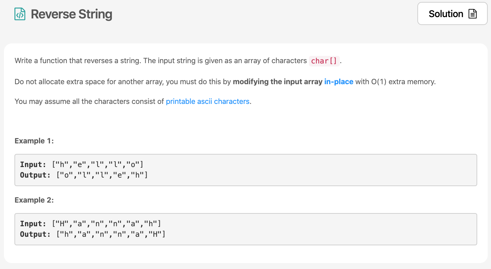
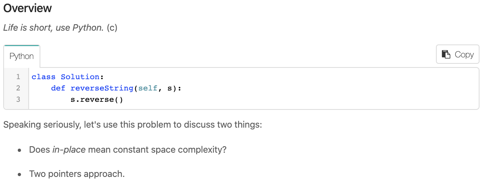

의지 활활🔥 Day1의 두번째 문제를 폴어보자! [Reverse String](https://leetcode.com/explore/learn/card/recursion-i/250/principle-of-recursion/1440/) 이다.



# 문제 요약
string array를 뒤집어보자.
시간복잡도는 따로 명시되어 있지 않고, 공간 복잡도는 O(1)라고 되어있다. 추가적으로 메모리를 할당하지 말고 문제를 해결해야 한다.

# 문제 해결
이 문제는 two pointer관련 문제인데 ㅋㅋ 나는 JS로 푸니까 한줄로 끝났다. 룰루랄라~ 하면서 문제 해결을 딱 켰는데 해설지 첫 시작글이 너무 웃겼다. 
LIFE IS SHORT ㅋㅋㅋ
  

어쨌든 이 문제의 핵심은 two pointer이고, 출제 의도에 맞게 다시 풀어보았다.

## 1) 내장 함수 이용
```js
/**
 * @param {character[]} s
 * @return {void} Do not return anything, modify s in-place instead.
 */
var reverseString = function(s) {
    return s.reverse();
};
```
## 2) Recursion을 이용한 two pointer 
  - 시간 복잡도: O(n)
  - 공간 복잡도: O(1)
  ```js
  /**
    * @param {character[]} s
    * @return {void} Do not return anything, modify s in-place instead.
  */
  var helper = (s, left, right) => {
      if(left < right) {
          const s_right_temp = s[right];
          s[right] = s[left];
          s[left] = s_right_temp;
              helper(s, left + 1, right - 1)
      } else {
          return
      }
  }
  var reverseString = function(s) {
      helper(s, 0, s.length-1)
      return s;
  };
  ```

## 3) Iteration을 이용한 two pointer 
  - 시간 복잡도: O(n)
  - 공간 복잡도: O(1)

```js
/**
 * @param {character[]} s
 * @return {void} Do not return anything, modify s in-place instead.
 */
var reverseString = function(s) {
    let left = 0, right = s.length - 1;
    while (left < right) {
        let tmp = s[left];
        s[left++] = s[right];
        s[right--] = tmp;
    }
    return s;
};
```
