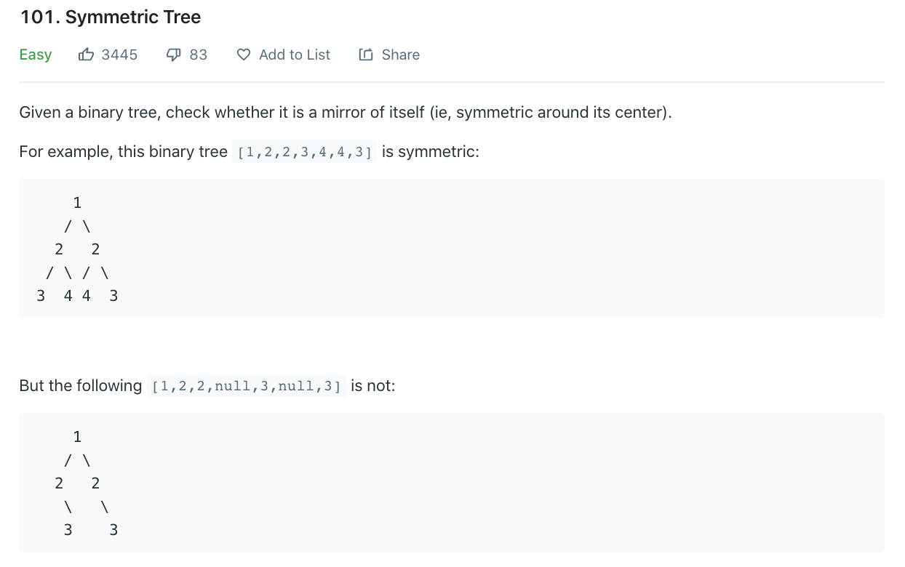

의지 활활🔥 Day2가 밝았습니다. 오늘은 BFS의 [문제](https://leetcode.com/problems/symmetric-tree/)를 풀어보자!



# 문제 요약
데칼코마니인지 확인하는 문제!

# 문제 해결
이 문제는 BFS보다는 DP로 해결한 것 같다.

## 1) recursive
```js
/**
 * Definition for a binary tree node.
 * function TreeNode(val) {
 *     this.val = val;
 *     this.left = this.right = null;
 * }
 */
/**
 * @param {TreeNode} root
 * @return {boolean}
 */
var isMirror = function(left, right) {
    if(left == null && right == null) return true;
    if(left == null || right == null) return false;
    return (left.val == right.val)
        && isMirror(left.right, right.left) 
        && isMirror(left.left, right.right)
}
var isSymmetric = function(root) {
    if (!root) return true;
    return isMirror(root.left, root.right);
};
```