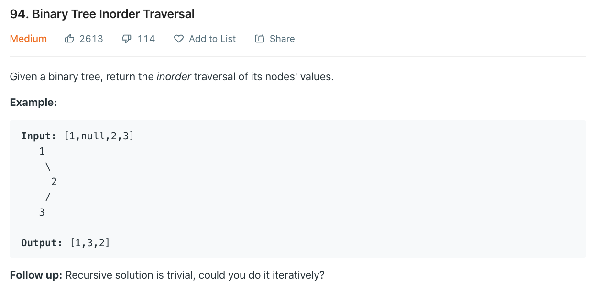

오늘도 어김없이 의지 활활🔥 Day3가 밝았습니다. 오늘은 binary tree의 traversal관련 문제를 풀어볼껀데요, inorder 방식으로 순회하는 [문제](https://leetcode.com/problems/binary-tree-inorder-traversal/)를 풀어봅시다!



# 문제 요약
inorder 방식으로 트리 순회. 단, iteration 방법으로 문제풀기

# 문제 해결
이 문제는 stack에 현재 순회해야 하는 애들을 쌓아두고 `왼쪽-root-오른쪽` 방식으로 순회한다.

## 1) iteration
```js
/**
 * Definition for a binary tree node.
 * function TreeNode(val) {
 *     this.val = val;
 *     this.left = this.right = null;
 * }
 */
/**
 * @param {TreeNode} root
 * @return {number[]}
 */
var inorderTraversal = function(root) {
    const stack = [];
    const result = [];
    let node = root;
    while(node != null || stack.length > 0) {
        while(node != null) {
            stack.push(node)
            node = node.left;
        }
        node = stack.pop();
        result.push(node.val);
        node = node.right;
    }
    return result;
};
```