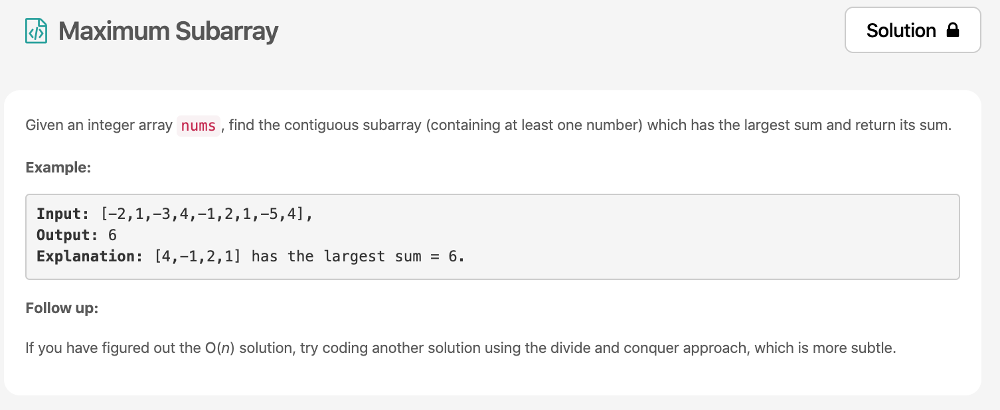
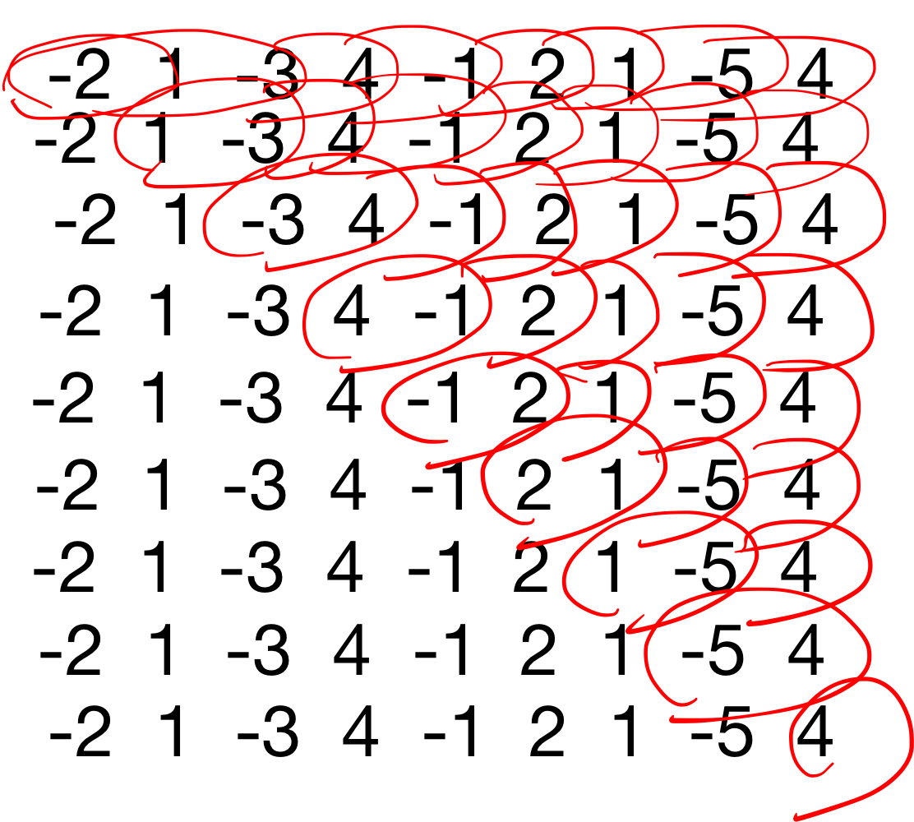
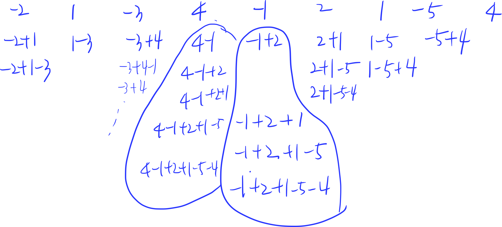
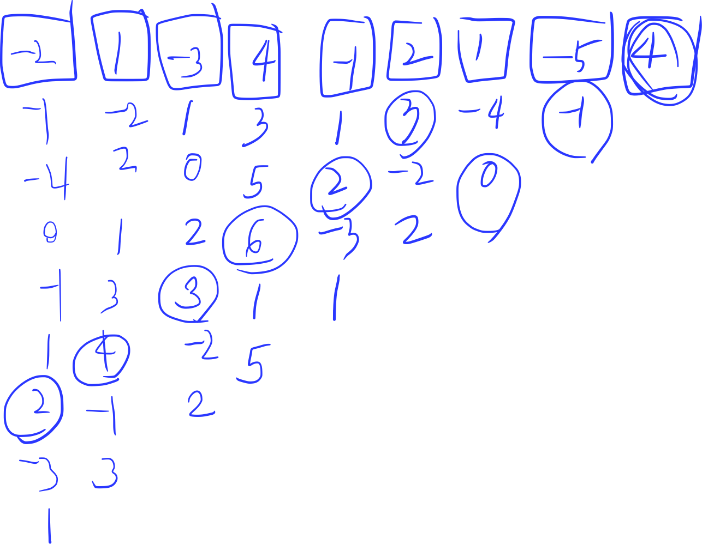

의지가 너무 활활🔥 leetcode의 30Day Challenge [문제](https://leetcode.com/explore/featured/card/30-day-leetcoding-challenge/528/week-1/3285/)를 풀어봅시다. 



# 문제 요약
가장 합이 큰 부분집합 구하기

# 문제 해결
이 문제는 다이나믹 프로그래밍으로 오른쪽 부터 모든 경우의 수를 구해보면 문제 풀이가 쉬워집니다.
모든 경우의 수를 찾으면 다음과 같고,


메모이제이션을 사용하면 모든 경우의 수를 다음과 같이 구할 수 있습니다.


항상 모든 값을 저장하고 있을 필요는 없고, 현재 값, 지난 값에서 최댓값, 여태껏 가장 최댓값(정답)을 가지고 비교를 하면 됩니다.
그림을 참고하시고 제가 풀이한 코드를 보시면 더 쉽게 이해할 수 있습니다.


## 1) DP
```js
/**
 * @param {number[]} nums
 * @return {number}
 */
var maxSubArray = function(nums) {
    let maxNum = nums[nums.length-1]; // 마지막 값으로 초기화
    let sumNum = nums[nums.length-1]; // 마지막 값으로 초기화
    if(nums.length == 1) return maxNum;
    for(let i=nums.length-2; i>=0; i--) {
        const curNum = nums[i]
        sumNum = Math.max(curNum + nums[i+1], curNum + sumNum);
        maxNum = Math.max(curNum, sumNum, maxNum);
        console.log(curNum, sumNum, maxNum)
    }
    return maxNum;
};
```