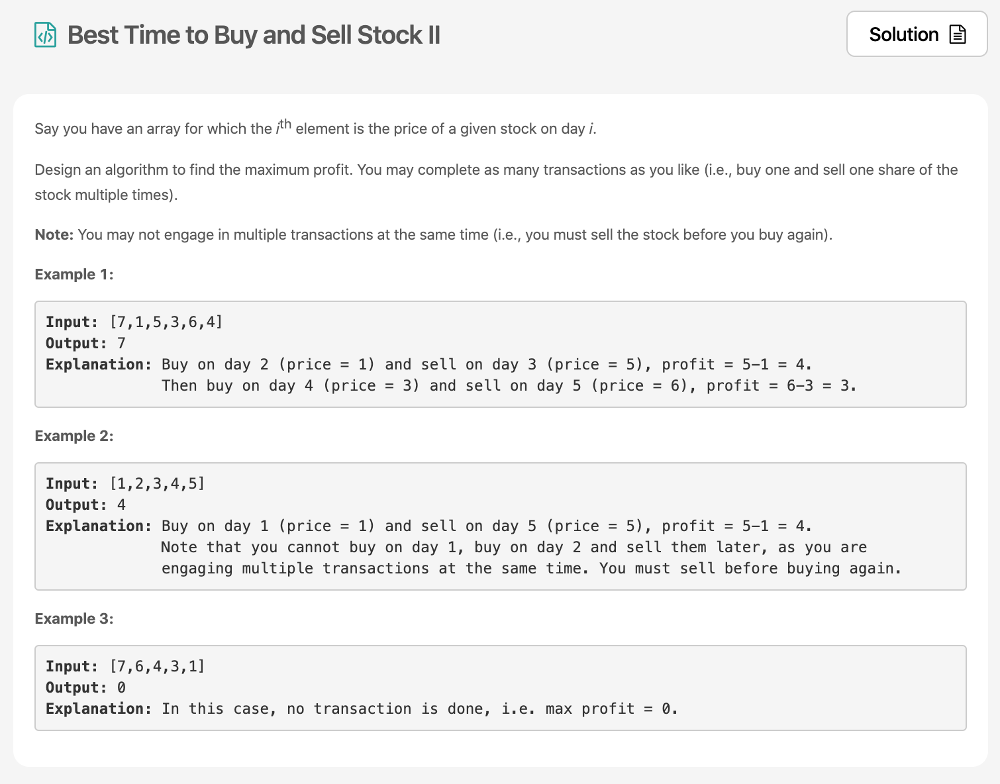

오늘두 알고리즘 퐈이어🔥 leetcode의 30Day Challenge는 정말 좋은것 같다. 뭘풀지를 정해주고 그렇게 까지 어렵지않은 문제들로 구성되있어서 더더욱 의지가 꺾이지 않고 달릴 수 있는 것 같다. 요즘 주식으로 핫해서 그런가 언제  [주식을 사고 판것의 이득을 구하는 문제](https://leetcode.com/explore/challenge/card/30-day-leetcoding-challenge/528/week-1/3287/)를 풀어봅시다. 



# 문제 요약
가장 이윤에 남는 방식으로만 주식을 사고 팔아서 얻은 수익을 계산해보자. ~~현실세계에서는 예측이 어려우니 절대 불가능한 일이지만 ㅋㅋ 여기서는 이윤을 다 안다는 가정하에 진행한다.~~ complexity에 대해서는 따로 추가적인 조건은 없었다.

# 문제 해결
문제는 해결했는데 공간 복잡도 O(1), 시간 복잡도 O(n^2)으로 해결했다. O(n)으로 해결할 수 있는 방법들이 솔루션에 있었는데 해당 방법들도 다시 검토 해 볼 필요가 있다.

## 1) Brute Force ~~(무식한 방법)~~
브루트포스 알고리즘은 모는 경우의 수를 다해보는 알고리즘이다. 난 이렇게 안했다. 이렇게 하면 공간복잡도는 O(n), 시간 복잡도가 이미 O(n^n)이 되버린다. n제곱도아니고 n^n이다 ㅋㅋㅋ

## 2) Peak Valley Approach
난 이방법으로 해결했다.
peak와 valley를 찾아서 그 차이를 계속 더하는 것이다.
난 일단 순회를 하되 현재 순회중인 애가 Peak인지 확인하게 했고, valley를 가리키는 포인터(index)를 저장하여 그것의 차를 뺐다.
그림을 보면 더욱 이해가 쉽다.

코드는 내가 짠게 더 쉬운것 같아서 내 코드를 첨부한다.
  * 시간 복잡도 O(n), 공간복잡도 O(1)

```js
/**
 * @param {number[]} prices
 * @return {number}
 */
var maxProfit = function(prices) {
    let minIdx = 0;
    let sum = 0;
    for(let i=0; i<prices.length; i++) {
        if(prices[minIdx] > prices[i]) {
            minIdx = i;
        }
        if(prices[minIdx] < prices[i]) {
            sum += prices[i] -  prices[minIdx];
            minIdx = i;
        }
    }
    return sum;
};
```

## 2) Simple One Pass
이렇게 쉬운 문제였는데! 사실 세번째 풀이를 보면 이 문제는 그냥 현재보다 전것이 더 작은 것의 차의 합을 구하는 문제였다는 것을 알 수 있다.
내가 짠 코드랑 complexity는 동일해서 큰 아쉬움은 없지만, 그래도 좀 더 크게 문제를 바라봐야겠다.

  * 시간 복잡도 O(n), 공간복잡도 O(1)
```js
/**
 * @param {number[]} prices
 * @return {number}
 */
var maxProfit = function(prices) {
    let sum = 0;
    for(let i=1; i<prices.length; i++) {
        if(prices[i] > prices[i-1]) {
            sum += prices[i] - prices[i - 1];
        }
    }
    return sum;
};
```