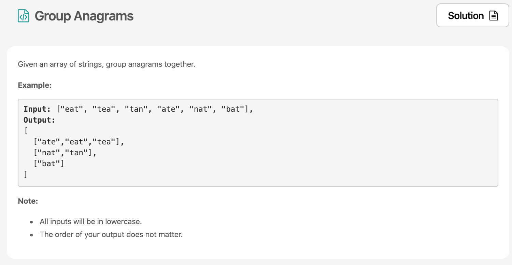

오늘은 30-Day LeetCoding Challenge Week1 마감 데이이다🔥그래서 부랴부랴 밀린 3문제를 모두 풀어보았다! 이번 포스팅에서는 [anagrams](https://leetcode.com/explore/challenge/card/30-day-leetcoding-challenge/528/week-1/3288/)와 관련된 문제풀이를 해보도록 하겠다.



# 문제 요약
anagrams은 단어를 구성하는 알파벳을 재배열해서 새로운 단어를 만들 수 있는 것을 말한다. 그래서 문제의 예시처럼 "eat", "tea", "ate"는 하나의 anagrams 그룹으로 묶을 수 있다.

# 문제 해결
anagram인지는 어떻게 판단하면 좋을까? 단어를 구성하는 알파벳을 순서대로 정렬한 다음 비교해보면 될 것이다. `s.split('').sort().join('')` 이렇게! 문제에서 anagram이 있는지 찾는지를 어떻게 구현할지도 생각해 봐야하는데, key값으로 `구성하는 알파벳을 순서대로 정렬한 값`을 저장해서 판단하도록 하면된다. 이것이 가장 심플하고 복잡도도 낮다.

실제로 leetcode solution을 보면 
  * Approach 1: Categorize by Sorted String
  * Approach 2: Categorize by Count
두 가지가 있는데, JS의 map을 이용하면 Approach 1로 쉽게 풀 수 있고, Approach 2는 크게 매력적인 해결책이 아니어서 패스하도록한다.


## 1) Categorize by Sorted String
위에서 이야기 했듯이 단어를 구성하는 알파벳을 순서대로 정렬한 다음 key값으로 저장하여 비교한다.

```js
/**
 * @param {string[]} strs
 * @return {string[][]}
 */
var groupAnagrams = function (strs) {
    const map = new Map();
    const getKey = (s) => {
        return s.split('').sort().join('')
    }
    for (let item of strs) {
        const key = getKey(item);
        if (map.get(key)) {
            map.get(key).push(item);
        } else {
            map.set(key, [item]);
        }
    }
    return [...map.values()];
};
```
# 소감
사실 위의 해결책은 내 코드는 아니었고, 검색하다가 다른사람의 코드를 참고했다. 
나는 정말 if를 떡칠하면서 오랜 시간동안 문제를 해결하지 못했다. 너무 오랫동안 고민해서 그런가 저 코드를 보고 엄청나게 충격적이었다. 너무 심플해서 🤯
그치만 덕분에 다음문제를 내 스스로 풀 수 있었다.