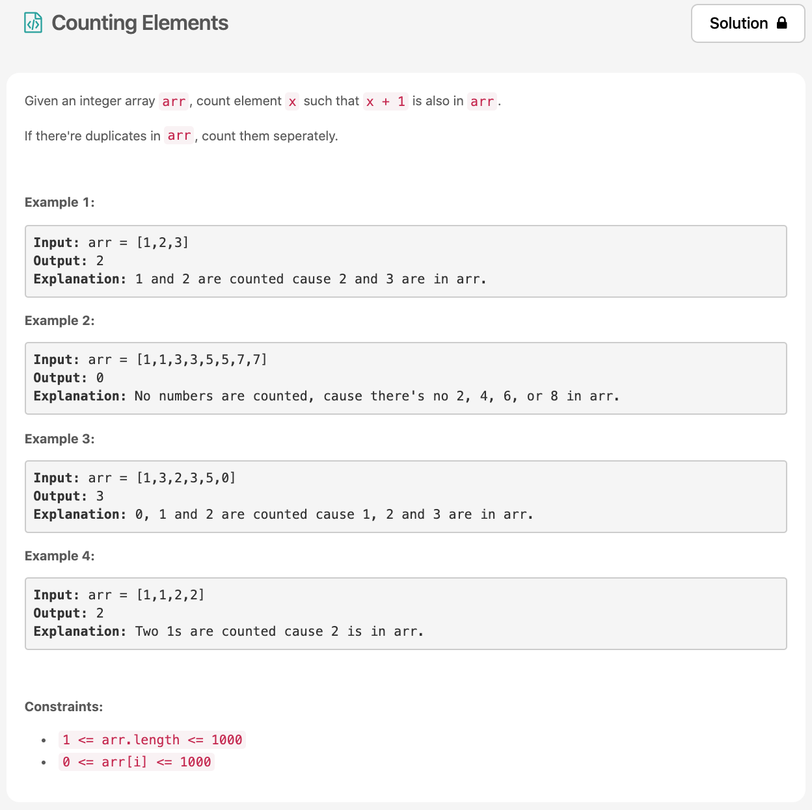

오늘의 두번째 문제 😃전에 푼 anagrams 문제 덕분에 이 [문제](https://leetcode.com/explore/challenge/card/30-day-leetcoding-challenge/528/week-1/3289/)는 조금 더 쉽게 풀 수 있었다.



# 문제 요약
문제는 굉장히 심플하다. 자기 자신 + 1인 수의 갯수를 세는 문제다.

# 문제 해결
anagram에서 처럼 배열의 모든 element를 순회하면서 map에 저장하는데, 해당 값을 키값으로 하고 value로 true를 주도록 했다. 그러고 다시 순회를 하면서 자기 자신보다 하나 더 큰수가 map에 저장되있는지 확인하고 counting을 하도록 했다.

## 1) Categorize by element
  * 시간 복잡도 O(n)
  * 공간 복잡도 O(n)
  으로 문제를 해결했다.
```js
/**
 * @param {number[]} arr
 * @return {number}
 */
var countElements = function(arr) {
    const map = new Map();
    for (let num of arr) {
        map.set(num, true);
    }
    let cnt = 0;
    for (let num of arr) {
        if (map.get(num+1)) {
           cnt++;
        }
    }
    return cnt;
};
```