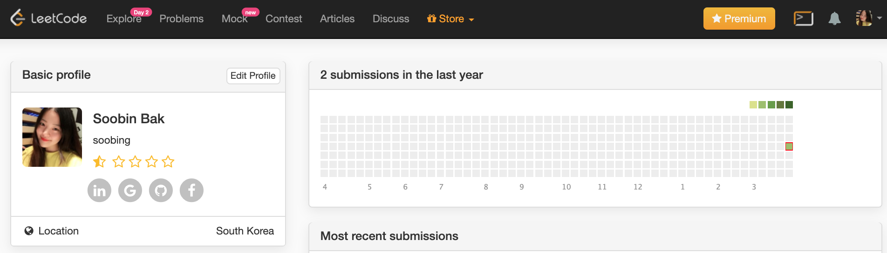

<hr/>

<!-- ```toc
# This code block gets replaced with the TOC
exclude: Table of Contents
tight: false,
from-heading: 1
to-heading: 6
``` -->

# 시작
이것은 다짐글이다.
이제 한문제씩 풀고 매일매일 포스팅을 할 계획이다.

사실 학부시절 수업시간때 부터 알고리즘을 싫어했었다.
왜 해야되는지 모르겠기 때문이다.

~~사실 지금도 크게 왜 해야하는지 모르겠...~~
여태까지 안할 방법 찾아서 요리저리 피해왔는데

피할 수 없는 필수요소임을 인터뷰 후기나 채용공고를 보면느낀다 😖
한번은 부딪혀야할 관문인것 같다.

언젠간 왜 필요한지 이유를 찾길 바라며 !


# 계획
내 계획은 단기 계획이 아니다 🤔
~~박새로이처럼 10년짜리 계획이 될 것이다~~ 는 너무 오래 걸리고 1년 목표로한닷! 가즈아!
leetcode에 잔디심기를 시작하겠습니다.