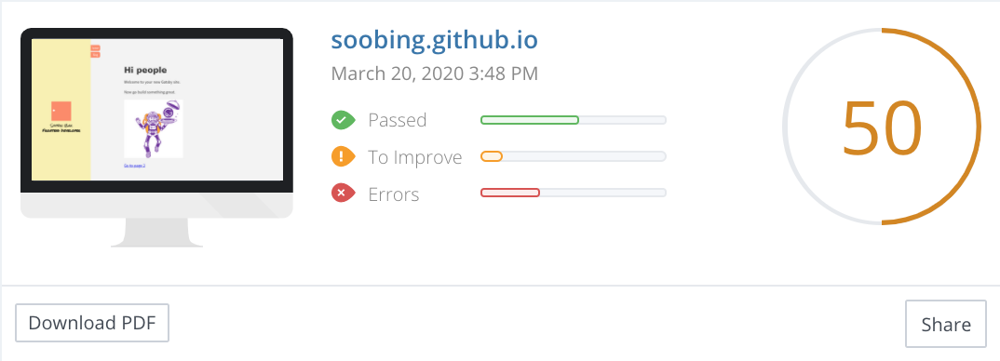

# SEO 지수 확인
일단 블로그는 개설했는디... SEO가 잘되고 있는지 구글에  요렇게 👉🏻 `how to check seo ranking` 검색을 해보았다.   

여러 광고들이 있었지만 
[woorank](https://www.woorank.com/) 라는 사이트가 가장 괜찮아 보였다.

  
그래서 내 웹사이트를 넣었더니 44점이 나왔다;;

기존에 주로 사용하던 naver 블로그의 점수를 봐보니 64점. 생각보다 점수가 높지 않았다. (medium 같은 사이트를 보면 82점 정도로 굉장히 높다.) 어쩐지 네이버 블로그가 노출이 많이 안되는 느낌적인 느낌이 맞았다.

# SEO 지수를 높여보자! 어떻게? 
## step 1. 문제점 파악
우선순위 순으로 정리
* 상
  + Robots.txt가 없다
  + description (meta tag)가 없음
  + Schema.org item이 없다. (🤔이게 뭐임?)
  + OpenGraph protocol 중 'og:image'가 없음 (그래서 링크를 공유하면 이미지가 안떴었음)
  + sitemap.xml이 없음. (아래 문제 해결 2번까지 하다보니까 나온 이슈)
* 중
  + analytics tool이 없음 (google analytics 달꺼얌)
  + favicon 반영 안됨 (분명히 🍉수박으로 바꿨는데 개츠비 기본 favicon이 뜸)
* 하
  + Your headers are not properly set up to use HSTS. (뭔소린지 모름)
  + Asset Cacheability (asset들이 캐싱안된다는 말 같음)
  + Backlinks Score Bad (라고 하는데 backlinks가 뭔지 모름)
  + Traffic Estimations - very low (이건 내가 어떻게 할 수 있는 부분이 아님! 그러니까 내가 seo를 개선하려고 하지!)
  + Social profile 연결 (연결 할지 안할지 생각해볼꺼지롱👅)

자 이제 하나씩 해결해보자!

## step2. 문제점 해결
1. Robots.txt 추가 ([gatsby-plugin-robots-txt](https://www.gatsbyjs.org/packages/gatsby-plugin-robots-txt/) 사용해서 추가 함)
2. description (meta tag) 추가
  + 이거 반영을 위해 해당 [tutorial](https://www.gatsbyjs.org/tutorial/seo-and-social-sharing-cards-tutorial/) 을 참고했다.
  + tutorial에서 수정할 내용들도 보여서 [PR](https://github.com/gatsbyjs/gatsby/pull/22426) 도 올렸다. 지금 gatsby master브랜치에서 link 에러가 발생해서 내꺼까지 영향을 미쳤다 🙄
  + 1, 2번 까지 적용하고 배포하니까 50점 까지 높아졌다 ㅋㅋ 오 신기~
  
  + 그리고 추가적으로 `sitemap.xml`이 없다는 안내가 떴다. 기존엔 안떴었는데;; 아마 뭔가에 가려져서 이것까지 판단하지 못했던것 같다. 이것은 다섯번째에서 해결해 주도록 하겠다.
  [sitemap-warning](./woorank-sitemap.png)
5. sitemap 추가
  + sitemap이란? `detail all URLs on a website`. sitemap은 파일인데 xml 파일 일 수도 있고(보통) 뭐 여러 타입의 파일 일 수 있다. 그럼 이 파일이 어떤 정보를 담고있느냐? 하면 내 웹사이트에 있는 모든 URL에 관한 정보를 담고있다. 그래서 웹 크롤러가 내 사이트 정보를 크롤링할떄 조금 더 편리하게 긁어갈 수 있게한다. 구글 sitemap 관련 정보를 보면 사실 구글봇이 알아서 잘 긁어가지만 그럼에도 불구하고 sitemap이 있으면 더 효과적이라고 한다.
  + gatsby에서는 제공해주는 플러그인[gatsby-plugin-sitemap](https://www.gatsbyjs.org/packages/gatsby-plugin-sitemap/)이 있었다. 역시 플러그인 부자 개츠비ㅋㅋ 최고다최고 찾으면 다나온다.
## 참고하면 좋은 사이트들
* [Putting SEO First with Gatsby
](https://www.wesleylhandy.net/blog/seo-accessibility-first-gatsby.html)
* [Search Engine Optimization (SEO) and Social Sharing Cards with Gatsby
](https://www.gatsbyjs.org/tutorial/seo-and-social-sharing-cards-tutorial/)