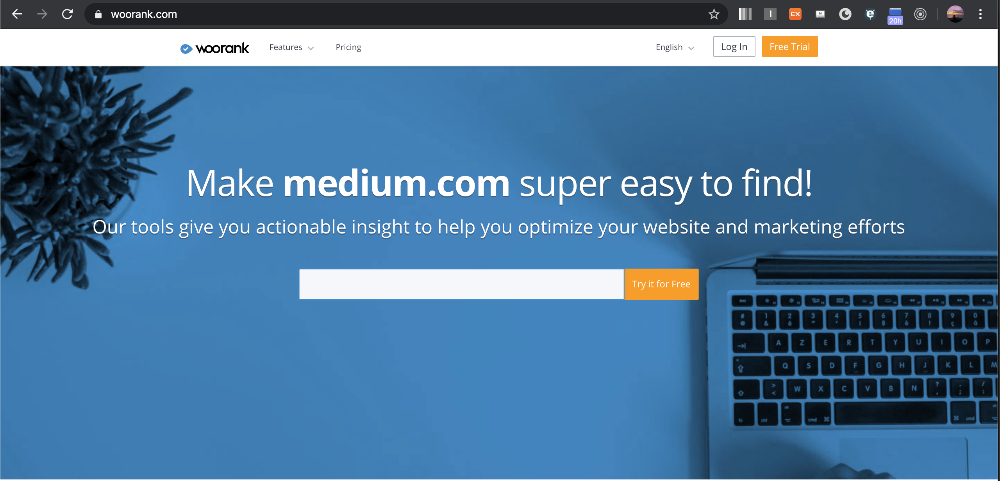

# SEO 지수 확인
일단 블로그는 개설했는디... SEO가 잘되고 있는지 구글에  요렇게 👉🏻 `how to check seo ranking` 검색을 해보았다.   

여러 광고들이 있었지만 
[woorank](https://www.woorank.com/) 라는 사이트가 가장 괜찮아 보였다.

  
그래서 내 웹사이트를 넣었더니 44점이 나왔다;;

현재 블로그인 naver블로그의 점수를 봐보니 64점. 생각보다 점수가 높지 않았다. (medium 같은 사이트를 보면 82점 정도로 굉장히 높다.) 어쩐지 네이버 블로그가 노출이 많이 안되는 느낌적인 느낌이 맞았다.

# SEO 지수를 높여보자! 어떻게? 
## step 1. 문제점 파악
우선순위 순으로 정리
* 상
  + Robots.txt가 없다
  + description (meta tag)가 없음
  + Schema.org item이 없다. (🤔이게 뭐임?)
  + OpenGraph protocol 중 'og:image'가 없음 (그래서 링크를 공유하면 이미지가 안떴었음)
* 중
  + analytics tool이 없음 (google analytics 달꺼얌)
  + favicon 반영 안됨 (분명히 🍉수박으로 바꿨는데 개츠비 기본 favicon이 뜸)
* 하
  + Your headers are not properly set up to use HSTS. (뭔소린지 모름)
  + Asset Cacheability (asset들이 캐싱안된다는 말 같음)
  + Backlinks Score Bad (라고 하는데 backlinks가 뭔지 모름)
  + Traffic Estimations - very low (이건 내가 어떻게 할 수 있는 부분이 아님! 그러니까 내가 seo를 개선하려고 하지!)
  + Social profile 연결 (연결 할지 안할지 생각해볼꺼지롱👅)

자 이제 하나씩 해결해보자!